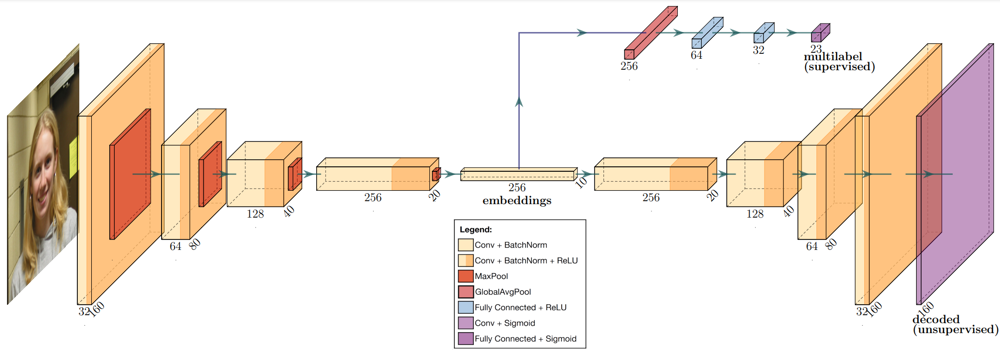

# ICAONet

 > `ICAONet` is the first deep multitask learning-based method designed for automatic evaluation of the photographic requirements of the ISO/IEC 19794-5 standard.



# Runing ICAONet

To run ICAONet on your own image, you can either run the predict script:

```py
python predict.py path/to/image.png 
```

or you can run the [Inference Notebook][inference-notebook].

# Thesis

- [Overleaf][overleaf]
- [Latex Files][thesis]

# Published Results

If you are looking for the code published on **Expert Systems with Applications** or the **FVC-ongoing**, please go to [v0.6.4 branch][paper-branch]. The Jupyter notebook is located on `notebooks/supervised_unsupervised/Multilearning.ipynb` and the submited C++ application is under `vsproject` folder.

# How to cite

```
@article{DEANDRADEESILVA2022116756,
title = {A collaborative deep multitask learning network for face image compliance to ISO/IEC 19794-5 standard},
journal = {Expert Systems with Applications},
pages = {116756},
year = {2022},
issn = {0957-4174},
doi = {https://doi.org/10.1016/j.eswa.2022.116756},
url = {https://www.sciencedirect.com/science/article/pii/S0957417422002226},
author = {Arnaldo Gualberto {de Andrade e Silva} and Herman Martins Gomes and Leonardo Vidal Batista},
keywords = {Face quality, ICAO, ISO/IEC 19794-5, Multitask Learning, Autoencoders, Deep Learning},
abstract = {The face is considered the primary biometric trait for machine-readable travel documents, like passports. In this context, the ISO/IEC 19794-5 standard defines a set of photographic requirements to ensure image quality and simplify the face recognition process. However, the assessment of face image compliance to the ISO/ICAO standard is still mostly performed by humans today due to the lack of automatic evaluation systems to perform this task. In this paper, we present the first deep multitask learning-based method designed for automatic evaluation of the photographic requirements of the ISO/IEC 19794-5 standard, called ICAONet. We extended undercomplete Autoencoders to employ a multi-and-collaborative learning approach, where both supervised and unsupervised learning is performed concurrently and in a collaborative manner. The method is trained using an ad hoc image dataset and evaluated by an official benchmark system also used by other approaches presented in the literature. The results show that our method achieves the best results in terms of Equal Error Rate for 9 out of the 23 photographic requirements of ISO/IEC 19794-5, which was not achieved by any other individual method evaluated. Therefore, the proposed method can be considered the best overall solution among academic works published in the literature and private SDKs. Overall, the median Equal Error Rate (3.3%) is also competitive. Finally, in terms of running time, the proposed method stands out among the fastest to evaluate all 23 requirements according to the official benchmark.}
}
```

[miniconda]: https://conda.io/miniconda.html
[paper-branch]: https://github.com/arnaldog12/icaonet/tree/v0.6.4
[inference-notebook]: https://github.com/arnaldog12/icaonet/blob/master/notebooks/Inference.ipynb
[overleaf]: https://www.overleaf.com/project/5e244465ac891100017b0767
[thesis]: https://github.com/arnaldog12/phd-thesis
